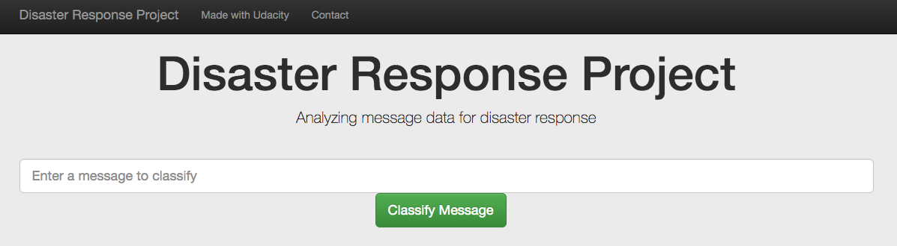

# Disaster Response Pipeline Project

### Description 
This project is part of Udacity data science nanodegree program. The dataset from Figure Eight includes messages in real disaster events. The goal of this project is to bulid a Natural Language Processing (NLP) model to classify messages.

The project includes three sections:
1. An ETL pipeline to process data.
2. A machine learning pipeline to train data.
3. A web app to classify messages.

### Web app screenshot

### Github repository:
https://github.com/tyuion/disaster-response

### Installation
This project requires python 3.X and the following libraries:
Numpy, Pandas, Matplotlib, Sciki_learn, NLTK, SQLalchemy, Pickle, Flask, Plotly, Sys, Re

### Instructions
1. Run the following commands in the project's root directory to set up the database and model.

    - To run ETL pipeline that cleans data and stores in database
        `python data/process_data.py data/disaster_messages.csv data/disaster_categories.csv data/DisasterResponse.db`
    - To run ML pipeline that trains classifier and saves
        `python models/train_classifier.py data/DisasterResponse.db models/classifier.pkl`

2. Run the following command in the app's directory to run your web app.
    `python run.py`

3. Go to http://0.0.0.0:3001/

### Acknowledgements
Udacity and Figure Eight for Code template and dataset.
